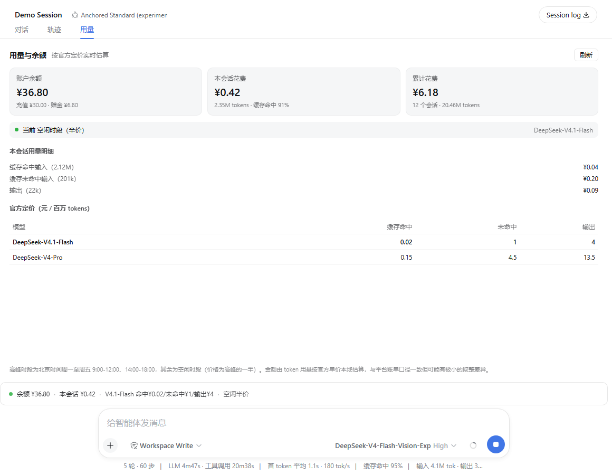
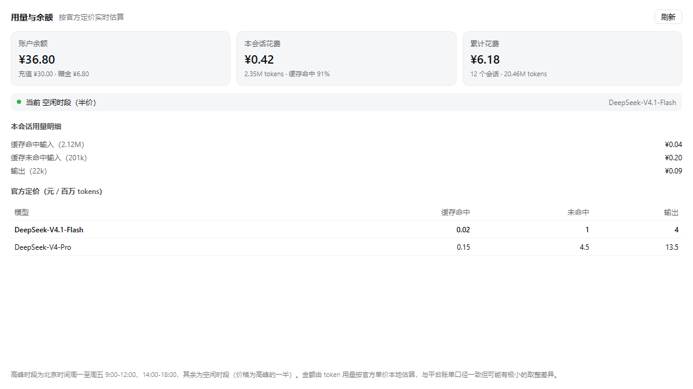

# dsh-usage-monitor

[English](README.en.md) | 简体中文

> 在 DeepSeek Harness（DSH）界面里直接显示 DeepSeek API 的**官方定价、会话用量花费、累计花费和账户余额**。

[](LICENSE)
[](package.json)



> 截图使用演示数据，不代表任何真实账户。

## 功能

- **账户余额**：查询 `GET https://api.deepseek.com/user/balance`，显示总余额、充值余额和赠金；默认 60 秒缓存，可手动刷新。
- **本会话花费**：读取 DSH `tokenUsage` 投影，区分缓存命中、缓存未命中、写入缓存、输出四种 token 桶，按当前时段实时估算。
- **累计花费**：本地账本记录跨会话用量，采用增量计价，跨高峰/空闲时段也能准确累计。
- **官方定价**：内置 `deepseek-flash` 与 `deepseek-v4-pro` 单价，自动区分高峰/空闲时段。
- **两个入口**：
  - 对话主视图新增「用量」Tab，展示完整面板；
  - 输入框上方 dock 条常驻显示余额、本会话花费、当前模型单价和计价时段。
- **隐私安全**：不监听公网，不写密钥；详细说明见下方「安全与隐私」。

## 截图

### 完整用量面板



### 输入框 dock 条


## 安装

### 前置条件

- 已安装 DSH，例如 `@deepseek-ai/dsh`；
- 使用 `web` profile；
- 账户可用 DeepSeek API key，例如已经在 `~/.dsh/.credentials.yaml` 中配置，或通过环境变量 `DEEPSEEK_API_KEY` 提供。

### 1. 安装插件

```sh
dsh plugin --profile web add github:liyiersan/dsh-usage-monitor
```

也可以从本地目录安装：

```sh
dsh plugin --profile web add /path/to/dsh-usage-monitor
```

### 2. 在 profile patch 中插入插件

编辑 `$DSH_HOME/profiles/web/cordis.patch.yml`（默认 `~/.dsh/profiles/web/cordis.patch.yml`），加入：

```yaml
- insert:
    - id: usage-monitor
      name: '@local/dsh-usage-monitor'
```

### 3. 确认 API key 可用

插件不会自己保存 key，它会通过 DSH credentials 服务解析 `DEEPSEEK_API_KEY`，失败时回退到进程环境变量。

### 4. 重启 DSH

```sh
dsh web
```

打开任意会话，即可在顶部看到「用量」Tab，并在输入框上方看到用量 dock 条。

### 卸载

```sh
dsh plugin --profile web remove @local/dsh-usage-monitor
```

然后从 `cordis.patch.yml` 删除对应 `insert` 条目。可选手动删除本地账本：

```sh
rm -rf "$DSH_HOME/usage-monitor"
```

## 定价口径

单位：**元 / 百万 tokens**。高峰时段为北京时间周一至周五 `09:00-12:00`、`14:00-18:00`；空闲时段价格为高峰的一半。

| 模型 | 时段 | 缓存命中 | 缓存未命中 | 输出 |
|---|---:|---:|---:|---:|
| DeepSeek-V4.1-Flash | 空闲 | 0.02 | 1 | 4 |
| DeepSeek-V4.1-Flash | 高峰 | 0.04 | 2 | 8 |
| DeepSeek-V4-Pro | 空闲 | 0.15 | 4.5 | 13.5 |
| DeepSeek-V4-Pro | 高峰 | 0.3 | 9 | 27 |

计费规则：

- `cacheRead`（缓存命中输入）按缓存命中单价；
- `uncachedInput`（缓存未命中输入）按未命中单价；
- `output` 按输出单价；
- `cacheWrite`（写入缓存）官方未单列，本项目按未命中单价保守计算；
- 模型名包含 `pro`、`chat`、`reasoner` 时归入 V4-Pro；包含 `flash` 归入 Flash；无法识别时按 Flash 兜底并在界面标注。

> 金额为本地估算，和官方账单口径一致，但可能有极小取整差异。DeepSeek 价格可能调整，更新时请同时修改 `lib/pricing.js` 和 `lib/client.js` 中内联的定价副本。

## 工作原理

```text
DSH Host (Node)
  lib/index.js ── GET /user/balance ──> api.deepseek.com
       │
       ├─ GET  /usage-monitor/data   ──> browser client
       └─ POST /usage-monitor/report <── browser client
                                      │
                                      ├─ conversation.view「用量」Tab
                                      └─ conversation.input.dock dock 条
```

- `lib/index.js`：宿主半。解析凭据、查询余额、维护本地账本、暴露本地 HTTP 端点。
- `lib/client.js`：浏览器半。注册 `conversation.view` 和 `conversation.input.dock` 两个槽位，读取并上报数据。
- `lib/pricing.js`：纯函数计费引擎，供宿主和测试使用。
- 客户端内联了一份定价副本，避免浏览器运行时无法直接 import 服务端模块；修改价格时两处都要改。

## 目录结构

```text
dsh-usage-monitor/
├── lib/
│   ├── client.js      # 浏览器插件 bundle
│   ├── index.js       # 宿主插件
│   └── pricing.js     # 计费引擎
├── scripts/
│   ├── client-check.mjs
│   ├── inspect-session.mjs
│   └── smoke.mjs
├── test/
│   └── pricing.test.mjs
├── docs/screenshots/
├── package.json
├── README.md
├── README.en.md
└── LICENSE
```

## 开发与测试

```sh
npm test                 # 定价引擎单元测试
npm run test:client      # 客户端 bundle 离线校验
node scripts/smoke.mjs   # 服务端冒烟测试（会查询真实余额接口）
```

`scripts/smoke.mjs` 会使用临时 `DSH_HOME`，不会污染真实账本；它会从本地 DSH 凭据文件或环境变量读取 key，但只打印 key 长度，不打印 key 本身。

## 兼容性

当前版本在 DSH `0.1.1-rc.2` 的 `web` profile 上开发并验证（2026-09）。DSH 客户端 API 仍可能变化，升级 DSH 后如发现槽位或模型解析接口变化，请提交 issue 或 PR。

## 安全与隐私

- 不收集、不上传遥测数据；
- 插件本身不保存 API key；key 仅由 DSH credentials 服务或进程环境变量提供；
- 余额查询只发生在宿主侧，目标为 `https://api.deepseek.com/user/balance`；
- 本地账本保存于 `$DSH_HOME/usage-monitor/ledger.json`，只记录 session id 和 token 用量，不会提交到仓库；
- `/usage-monitor/*` 端点随 DSH webServer 监听回环地址；`/usage-monitor/report` 要求 `Content-Type: application/json`，用于降低 CSRF 风险；
- 建议开源使用者不要把自己本地账本、凭据文件或包含个人路径的日志提交到 Git。

## 贡献

欢迎提交 issue 和 PR。提交前请尽量运行：

```sh
npm test
npm run test:client
```

## License

[MIT](LICENSE)
